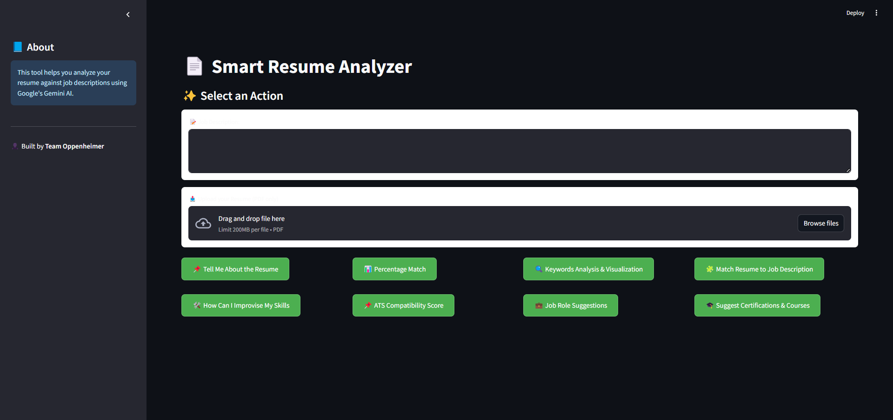
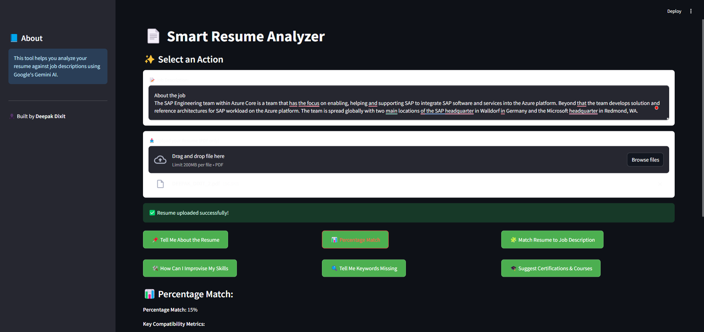

# 🧠 Smart Resume Analyzer

The **Smart Resume Analyzer** is a powerful AI-driven web application that enables users to upload their resumes (in PDF format), and instantly receive personalized feedback based on predefined HR criteria. It also generates a summary of the resume using Gemini-Pro API.

---

## 🚀 Features

- 📄 Upload Resume in PDF Format
- 📊 Evaluate Resume Against Key Parameters:
  
  📄 **Resume Summary** (Gemini-powered)
  🛠 **Skill Gap Analysis**
   📊 **ATS Compatibility & Match Percentage**
  🔍 **Keyword Detection & Word Cloud**
  💼 **Job Role Recommendations**
  🎓 **Course & Certification Suggestions**
  🧩 **Resume Tailoring to Job Description**

- 💬 AI-Generated Summary (via OpenAI API)
- ✅ Get Instant Score & Feedback
- 🧠 Powered by NLP and AI

---

## 🛠️ Tech Stack

- **Python**
- **Streamlit** – for interactive UI
- **PyPDF2** – for parsing PDF files
- **re (Regex)** – for data extraction
- **Gemini GPT** – for intelligent feedback and summaries

---

## 🧪 How to Run Locally

### 1. Clone the Repository

```bash
git clone https://github.com/your-username/smart-resume-analyzer.git
cd smart-resume-analyzer

---

## 🚀 Getting Started

### 📦 2. Install Dependencies

Make sure Python 3.7+ is installed, then run:

```bash
pip install -r requirements.txt
```

---

### 🔑 3. Add Your OpenAI API Key

Create a `.env` file in the root directory and add:

```env
OPENAI_API_KEY=your_openai_key_here
```

> ⚠️ **Note:** Alternatively, you can replace the key directly in the code (not recommended for production).

---

### ▶️ 4. Run the App

```bash
streamlit run app.py
```

---

## 📷 Screenshots

### 🖥️ Preview 1


### 🖥️ Preview 2


---

## 📁 File Structure

```bash
smart-resume-analyzer/
│
├── app.py                # Streamlit app code
├── requirements.txt      # Python dependencies
└── README.md             # Project documentation
```

---

## 📌 To-Do

- [ ] Add more NLP-based checks  
- [ ] Integrate ML model for scoring  
- [ ] Improve UI with custom design  

---

## 🧑‍💻 Author

**Deepak Dixit**  
📧  
🔗 [GitHub](https://github.com/Thedeepakdixit/smart-resume-analyzer.git) |

---
